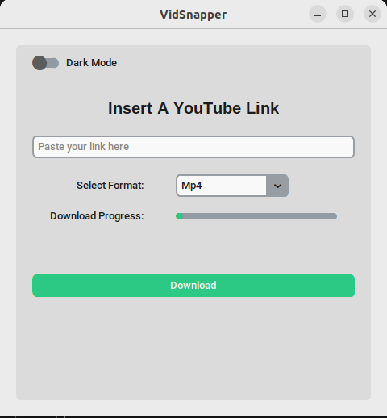

# VidSnapper

**VidSnapper** is a simple, user-friendly desktop application that allows you to download videos and audio from YouTube using the Python library `pytubefix`. This tool provides a graphical user interface (GUI) built with `CustomTkinter`, offering features such as light/dark mode switching, progress tracking, and format selection.

## Features

- **Download YouTube Videos**: Download videos in the highest resolution available.
- **Extract Audio**: Save audio files in MP3 format from YouTube videos.
- **Progress Tracking**: See the download progress in real-time.
- **Light/Dark Mode**: Toggle between light and dark modes to suit your preferences.
- **Responsive Design**: The interface adapts to different window sizes for an optimal user experience.

## Screenshots




## Installation

### Prerequisites

- Python 3.x
- `pip` (Python package installer)

### Setup

1. **Clone the Repository:**
   ```bash
   git clone https://github.com/yourusername/VidSnapper.git
   cd VidSnapper
2. **Install the Required Packeges:**
   ```bash
   pip install -r requirements.txt
4. **Run the Application:**
   ```bash
   python main.py

## Usage

1. **Enter a YouTube Link**: Paste the YouTube video link into the provided input field.
2. **Select Format**: Choose whether to download the video as `Mp4` or extract the audio as `Mp3`.
3. **Download**: Click the `"Download"` button to start the download. The progress bar and percentage will update in real-time.
4. **Change Mode**: Use the `"Dark Mode"` switch to toggle between light and dark modes.

## Dependencies
- **CustomTkinter:** A modernized version of Tkinter for better-looking GUI applications.
- **pytubefix:** A fork of the original pytube library that is patched to handle YouTube's bot detection.

## Acknowledgements

- **pytubefix**: For providing a reliable way to download YouTube videos and audio.
- **CustomTkinter**: For enhancing the visual appeal of traditional Tkinter applications.


